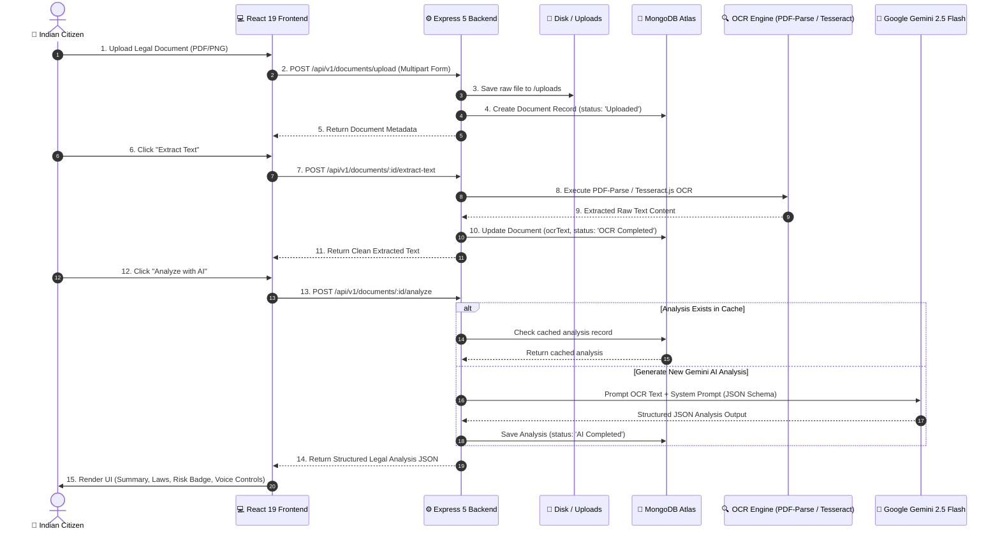

<div align="center">


### *Empowering 1.4 Billion Indian Citizens to Understand, Assess & Speak Legal Documents*


</div>

---

## 📌 Table of Contents

- [💡 About The Project](#-about-the-project)
- [👥 Team & Collaborators](#-team--collaborators)
- [✨ Key Features](#-key-features)
- [🛠 Tech Stack](#-tech-stack)
- [📂 Project Structure](#-project-structure)
- [📐 System Architecture](#-system-architecture)
- [🚀 Quick Start & Installation](#-quick-start--installation)
- [📖 API Documentation](#-api-documentation)
- [🎙 Voice Assistant & Multilingual AI](#-voice-assistant--multilingual-ai)
- [🏛 Legal Help Hub & Directory](#-legal-help-hub--directory)
- [📜 5-Minute Hackathon Demo Script](#-5-minute-hackathon-demo-script)
- [🔒 Security & Production Architecture](#-security--production-architecture)
- [🤝 Collaboration & Credits](#-collaboration--credits)

---

## 💡 About The Project

**Kanoon-Mate** is an end-to-end, production-ready legal AI platform designed to break down legal barriers for Indian citizens. Over **85% of citizens** struggle to read legal notices, court summons, rent agreements, or FIR copies due to archaic legal language and dense terminology.

Kanoon-Mate bridges this gap by combining **Multi-Format OCR**, **Google Gemini 2.5 Flash AI**, **Statutory Indian Law Mapping**, **Voice Dictation/Read-Aloud**, and **Proactive Deadline Tracking**.

### 🎯 Key Objectives:
- 📄 **Plain Language Simplification:** Translates legal jargon into citizen-friendly summaries in simple English & Hindi.
- ⚖️ **Statutory Law Mapping:** Automatically cites applicable sections from *Bharatiya Nyaya Sanhita (BNS)*, *BNSS*, *BSA*, *Negotiable Instruments Act (Sec 138)*, and *Model Tenancy Act*.
- 🚨 **Risk & Urgency Assessment:** Color-coded risk indicators (🟢 Low, 🟡 Medium, 🔴 High) with automated deadline timeline alerts.
- 🎙️ **Voice Accessibility:** Speech-to-Text dictation and natural Text-to-Speech playback for low-literacy users.

---

## 👥 Team & Collaborators

### **Team Bro-Code**

| Avatar | Name | GitHub Username | Key Contributions |
| :---: | :--- | :--- | :--- |
|  | **Devansh Yadav** | [@ydevansh](https://github.com/ydevansh) | Project Lead, Frontend Architecture, Tailwind v4 UI System & Framer Motion |
|  | **Gaurav Kumar Yadav** | [@ggauravky](https://github.com/ggauravky) | AI Pipeline Integration, Gemini 2.5 JSON Schema Prompt Engineering & Voice STT/TTS |
|  | **Nikhil** | [@nikhilxagr](https://github.com/nikhilxagr) | Full-Stack Core, Express.js Backend Architecture, MongoDB Schemas & Security |

---

## ✨ Key Features

### 🔍 1. Multi-Format OCR & Document Processing Engine
- Upload digital PDFs or scanned document images (**PDF, PNG, JPG, JPEG** up to 20MB).
- Uses **PDF-Parse** for fast digital PDF text extraction and **Tesseract.js** for image OCR.
- Automatic text sanitization and normalization pipeline.

### 🤖 2. Gemini 2.5 AI Legal Analysis Engine
- Driven by **Google Gemini 2.5 Flash** with strict JSON Schema output mode.
- Generates structured analysis:
  - **Executive Summary** in simple, plain language.
  - **Risk Assessment Badge** (Low / Medium / High).
  - **Detected Laws Table** (Act name, specific section, and citizen context).
  - **Important Dates Timeline** for court appearances or notice expiry dates.
  - **Recommended Action Checklist** for immediate next steps.
  - **Suggested Follow-up Questions** for advocates or AI chat.
- **Intelligent DB Caching:** Saves completed analysis in MongoDB Atlas to prevent redundant LLM API costs.

### 💬 3. Context-Aware Legal AI Chat
- Real-time Q&A interface with statutory legal knowledge.
- Pre-loaded legal templates (Tenant Rights, Section 138 NI Act, Consumer Forum procedures, Zero FIR).
- Markdown rendering with legal citation cards & instant clipboard copy.

### 🎙️ 4. Voice Assistant & Multilingual Support
- **Speech-to-Text (STT):** Dictate legal queries in **English (`en-IN`)** or **Hindi (`hi-IN`)**.
- **Text-to-Speech (TTS):** Read AI analysis and chat answers aloud with Play ▶, Pause ⏸, Stop ⏹, and Replay 🔁 controls.
- Speed controls (`0.75x` to `1.5x`) for clear audio playback.

### 📅 5. Automated Deadline Tracker & Urgency Radar
- Extracts critical response windows and court dates automatically.
- Interactive timeline view with visual countdowns.
- Automatic visual warnings (🔴 Red alert when ≤5 days remaining).

### 🏛️ 6. Emergency Legal Help Hub & Directory
- Emergency 24/7 Helpline quick-dial bar: NALSA (`15100`), Cyber Crime (`1930`), Women Helpline (`1091`), Consumer Helpline (`1915`).
- Directory of verified State Legal Services Authorities (SLSA/DLSA), legal aid NGOs (HRLN, CHRI, Majlis), and pro-bono advocate panels.

---

## 🛠 Tech Stack

### Frontend

| Technology | Version | Purpose |
| :--- | :--- | :--- |
| **React** | `v19.0.0` | UI Component Framework |
| **Vite** | `v8.1.0` | Fast HMR Build Tool & Dev Server |
| **Tailwind CSS** | `v4.0` | Modern Utility-First Styling System |
| **Framer Motion** | `v12.4.0` | Micro-Animations & Page Transitions |
| **React Router DOM** | `v7.2.0` | Client-Side SPA Routing |
| **Axios** | `v1.8.1` | Asynchronous API Client |
| **Lucide React** | `v1.16.0` | High-Quality Modern Icon Set |
| **React Hot Toast** | `v2.5.2` | Interactive Toast Notifications |
| **Web Speech API** | Native Browser | STT Speech Recognition & TTS Speech Synthesis |

---

### Backend

| Package | Version | Purpose |
| :--- | :--- | :--- |
| **Express.js** | `v5.0.1` | RESTful API Web Server Framework |
| **Node.js** | `v20.x` | Asynchronous ESM JavaScript Runtime |
| **Mongoose** | `v9.0.0` | MongoDB ODM with Schema Validation |
| **@google/genai** | `v0.1.1` | Google Gemini 2.5 Flash AI API SDK |
| **Tesseract.js** | `v7.0.0` | Client/Server Image Optical Character Recognition |
| **PDF-Parse** | `v2.0.0` | Rapid PDF Document Text Extractor |
| **Multer** | `v1.4.5` | Secure Multipart Form-Data File Upload Handler |
| **jsonwebtoken** | `v9.0.2` | Secure JWT Authentication |
| **bcryptjs** | `v3.0.2` | Password Hashing with Salt Rounds |
| **express-validator** | `v7.2.1` | Request Parameter Validation & Sanitization |
| **cors** | `v2.8.5` | Origin Whitelisting Middleware |
| **dotenv** | `v17.3.1` | Environment Variable Management |

---

### Database & Cloud

| Infrastructure | Technology | Purpose |
| :--- | :--- | :--- |
| **Database** | **MongoDB Atlas** | Cloud NoSQL Database for Users, Documents & Cached AI Analysis |
| **AI Cloud** | **Google AI Studio** | Gemini 2.5 Flash LLM Inference |

---

## 📂 Project Structure

```text
Kanoon-Mate--HackethonProjects-/
│
├── frontend/
│   ├── public/                      # Static assets & icons
│   ├── src/
│   │   ├── App.jsx                  # Main application component
│   │   ├── main.jsx                 # Client entry point
│   │   ├── assets/                  # Images & media files
│   │   ├── components/              # Modular UI components
│   │   │   ├── ai/                  # AI Analysis cards & Voice controls
│   │   │   ├── common/              # Navbar, Footer, Buttons & Modals
│   │   │   ├── dashboard/           # Document Upload & List view
│   │   │   ├── help/                # Legal Help Hub & Directory
│   │   │   └── voice/               # Speech-to-Text / TTS components
│   │   ├── constants/               # Statutory act definitions & app config
│   │   ├── context/                 # AuthContext & VoiceContext
│   │   ├── data/                    # Seed data & static legal FAQs
│   │   ├── hooks/                   # Custom hooks (useSpeech, useAuth)
│   │   ├── pages/                   # Landing, Dashboard, Analysis, Chat
│   │   ├── routes/                  # AppRoutes with ProtectedRoute wrapper
│   │   ├── services/                # Axios API services (docApi, aiApi)
│   │   ├── styles/                  # Tailwind theme & design tokens
│   │   └── utils/                   # Helper utilities (formatters, risk colors)
│   ├── index.html                   # HTML template
│   ├── package.json
│   └── vite.config.js               # Vite configuration
│
└── backend/
    ├── src/
    │   ├── server.js                # Server initialization & port binding
    │   ├── app.js                   # Express configuration & middleware stack
    │   ├── config/                  # MongoDB database connection & Gemini config
    │   ├── controllers/             # Auth, Document & AI route controllers
    │   ├── middleware/              # Auth verification, Upload & Error handlers
    │   ├── models/                  # User, Document & Analysis Mongoose schemas
    │   ├── routes/                  # Express route definitions (/api/v1/*)
    │   ├── seeds/                   # Mock demo seeding scripts
    │   ├── services/                # Gemini AI Service & OCR Extractor Service
    │   ├── utils/                   # Custom ApiError & ApiResponse helpers
    │   └── validators/              # Express-validator schema rules
    ├── uploads/                     # Local storage for uploaded files
    ├── .env.example                 # Environment template
    └── package.json
```

---

## 📐 System Architecture

### 🔄 End-to-End Data Processing Flow



---

## 🚀 Quick Start & Installation

### Prerequisites
- **Node.js**: `v18.0.0` or higher
- **MongoDB**: Local MongoDB server or [MongoDB Atlas](https://www.mongodb.com/cloud/atlas) Connection String
- **Google Gemini API Key**: Free API key from [Google AI Studio](https://aistudio.google.com/)

### 1️⃣ Clone Repository
```bash
git clone https://github.com/ydevansh/Kanoon-Mate--HackethonProjects-.git
cd Kanoon-Mate--HackethonProjects-
```

### 2️⃣ Backend Setup
```bash
cd backend
npm install

# Create environment configuration file
cp .env.example .env
```

Configure your `backend/.env`:
```env
PORT=5000
NODE_ENV=development
MONGO_URI=mongodb://localhost:27017/kanoon_mate
JWT_SECRET=kanoon_mate_super_secret_jwt_key_2026
GEMINI_API_KEY=your_google_gemini_api_key_here
```

Start the Backend Server:
```bash
npm run dev
# Server running at http://localhost:5000
```

### 3️⃣ Frontend Setup
In a new terminal window:
```bash
cd frontend
npm install
npm run dev
# Client running at http://localhost:5173
```

> 💡 **Instant Demo Seeding:** A mock demo user session is pre-seeded into `localStorage` so judges can directly access the full dashboard at `http://localhost:5173/dashboard`.

---

## 📖 API Documentation

### 🔐 Authentication Endpoints

| Method | Endpoint | Description | Auth Required |
| :--- | :--- | :--- | :---: |
| `POST` | `/api/v1/auth/register` | Register new citizen user account | ❌ |
| `POST` | `/api/v1/auth/login` | Authenticate user & return JWT token | ❌ |
| `POST` | `/api/v1/auth/logout` | Clear user session token | ✅ |
| `GET` | `/api/v1/auth/me` | Fetch authenticated user profile | ✅ |

### 📄 Document & OCR Endpoints

| Method | Endpoint | Description | Auth Required |
| :--- | :--- | :--- | :---: |
| `POST` | `/api/v1/documents/upload` | Upload legal document (PDF/PNG/JPG) | ✅ |
| `GET` | `/api/v1/documents` | Fetch all user documents | ✅ |
| `GET` | `/api/v1/documents/:id` | Fetch single document details | ✅ |
| `DELETE` | `/api/v1/documents/:id` | Delete document & associated file | ✅ |
| `POST` | `/api/v1/documents/:id/extract-text` | Run PDF-Parse / Tesseract.js OCR | ✅ |

### 🤖 AI Analysis Endpoints

| Method | Endpoint | Description | Auth Required |
| :--- | :--- | :--- | :---: |
| `POST` | `/api/v1/documents/:id/analyze` | Run Gemini 2.5 Flash Legal Analysis | ✅ |
| `GET` | `/api/v1/documents/:id/analysis` | Fetch cached JSON legal analysis | ✅ |

---

## 🎙 Voice Assistant & Multilingual AI

Kanoon-Mate features native browser speech integration:

```text
[ 🎤 Dictate Legal Query ]  ──(Web Speech STT)──>  [ Text Query ]  ──>  [ Gemini AI ]
                                                                               │
[ 🔈 Read Aloud Response ]  <──(Web Speech TTS)──  [ JSON Insight ]  <─────────┘
```

- **Voice Actions:** `Play ▶`, `Pause ⏸`, `Resume`, `Stop ⏹`, `Replay 🔁`.
- **Multilingual Support:** Toggle seamlessly between **English (`en-IN`)** and **Hindi (`hi-IN`)**.
- **Playback Control:** Configurable speaking rates (`0.75x`, `1.0x`, `1.25x`, `1.5x`).

---

## 🏛 Legal Help Hub & Directory

Provides quick access to legal resources across India:

```text
  ┌─────────────────────────────────────────────────────────────┐
  │  NALSA Helpline: 15100  │ Cyber Crime Helpline: 1930        │
  │  Women Helpline: 1091   │ Consumer Helpline: 1915           │
  └─────────────────────────────────────────────────────────────┘
                                │
  ┌─────────────────────────────┴──────────────────────────────┐
  ▼                                                            ▼
[ State Legal Services Authorities (SLSA/DLSA) ]   [ Human Rights NGOs (HRLN, CHRI) ]
```

---

## 📜 5-Minute Hackathon Demo Script

> **Target:** Present maximum value proposition to judges in 300 seconds.

- **[0:00 - 0:45] Problem Statement:** Open landing page (`http://localhost:5173`). Explain that 85% of citizens cannot read legal notices or contracts.
- **[0:45 - 1:45] Upload & OCR:** Go to `/dashboard/upload`. Upload a court notice PDF. Show real-time extraction via PDF-Parse/Tesseract.js.
- **[1:45 - 3:15] Gemini AI & Risk Rating:** Click **"Analyze with AI"**. Show Risk Rating (🔴 High Risk), Summary, Statutory Law Mapping (BNS / Section 138 NI Act), and Action Plan.
- **[3:15 - 4:15] Voice Assistant:** Click **"Listen"** to hear the summary read aloud. Use Voice Assistant mic to dictate a question in Hindi/English.
- **[4:15 - 5:00] Help Hub & Wrap-up:** Show NALSA `15100` emergency dial bar, legal aid NGO directory, and summarize team achievements.

---

## 🔒 Security & Production Architecture

| Security Layer | Implementation Detail |
| :--- | :--- |
| **Input Sanitization** | `express-validator` sanitizes all incoming route parameters |
| **Upload Security** | File uploads restricted to PDF, PNG, JPG format with strict 20MB file cap |
| **Auth Security** | Passwords hashed using `bcryptjs` (salt factor 10); JWT cookies signed securely |
| **CORS Policy** | Strict domain origin whitelisting enabled |
| **AI Fallback Resilience** | Local legal fallback engine guarantees response if LLM API limits are reached |

---

## 🤝 Collaboration & Credits

Developed by **Team Bro-Code** for Hackathon 2026:

- **Devansh Yadav** — [@ydevansh](https://github.com/ydevansh)
- **Gaurav Kumar Yadav** — [@ggauravky](https://github.com/ggauravky)
- **Nikhil** — [@nikhilxagr](https://github.com/nikhilxagr)

---

<div align="center">

### ⭐ Star this repository if you find Kanoon-Mate useful!


</div>
