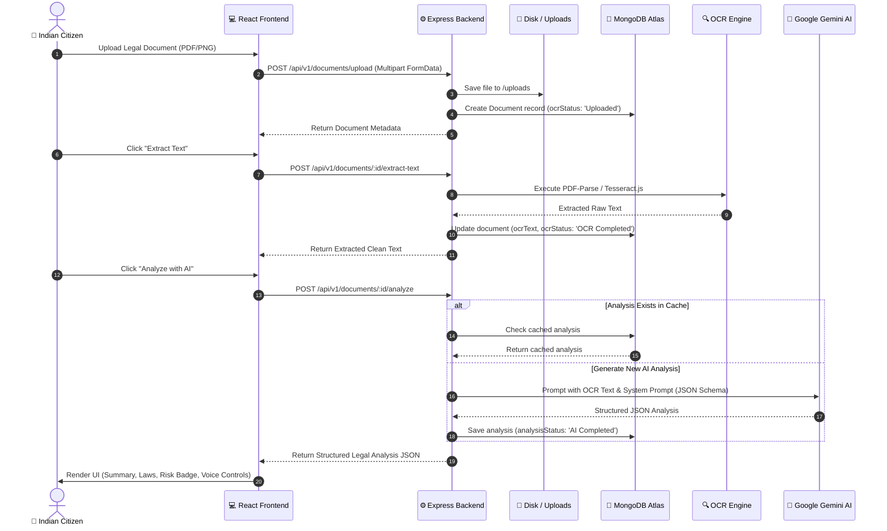

<div align="center">

# ⚖️ LawAssist AI
### *Understand Every Legal Document with AI*

[](https://react.dev/)
[](https://vitejs.dev/)
[](https://tailwindcss.com/)
[](https://nodejs.org/)
[](https://expressjs.com/)
[](https://www.mongodb.com/)
[](https://ai.google.dev/)
[](LICENSE)

---

**LawAssist AI** is an AI-powered legal assistant designed specifically for Indian citizens. It converts complex Indian legal contracts, court notices, rent agreements, and FIR copies into plain, citizen-friendly language—highlighting statutory laws, risk levels, deadlines, and actionable steps.

[🚀 Live Demo](#-quick-start) • [✨ Key Features](#-key-features) • [📐 Architecture](#-system-architecture) • [📖 API Docs](#-api-documentation) • [📜 Pitch Script](#-5-minute-hackathon-demo-script)

---

</div>

## 📌 Table of Contents

- [💡 Problem & Solution](#-problem--solution)
- [✨ Key Features](#-key-features)
- [📐 System Architecture](#-system-architecture)
- [🛠 Tech Stack](#-tech-stack)
- [🚀 Quick Start & Installation](#-quick-start--installation)
- [📖 API Documentation](#-api-documentation)
- [🎙 Voice Assistant & AI Capabilities](#-voice-assistant--ai-capabilities)
- [🏛 Legal Help Hub & Directory](#-legal-help-hub--directory)
- [📜 5-Minute Hackathon Demo Script](#-5-minute-hackathon-demo-script)
- [🔒 Security & Production Best Practices](#-security--production-best-practices)

---

## 💡 Problem & Solution

### The Problem
* Over **85% of Indian citizens** struggle to comprehend legal documents due to dense legalese and archaic terminology.
* Critical deadlines in court notices or cheque dishonour notices are often missed, resulting in severe penalties or default judgments.
* Professional legal advice can be expensive or inaccessible for low-income citizens and small business owners.

### The Solution: LawAssist AI
* **Instant Plain-Language Translation:** Explains complex legal clauses in simple English and Hindi.
* **Statutory Act Mapping:** Automatically detects and cites relevant Indian Acts (e.g. *Bharatiya Nyaya Sanhita (BNS)*, *BNSS*, *BSA*, *NI Act Section 138*, *Model Tenancy Act*).
* **Interactive AI Assistant & Voice Interface:** Real-time speech-to-text dictation and speech-synthesis read-aloud.
* **Proactive Deadline & Risk Tracking:** Color-coded risk assessment (Low 🟢, Medium 🟡, High 🔴) with automated timeline extraction.

---

## ✨ Key Features

<details open>
<summary><b>🔍 1. Multi-Format OCR & Document Processing Engine</b></summary>

* Accepts **PDF, JPG, JPEG, and PNG** files up to 20MB.
* Uses **PDF-Parse** for fast text extraction from digital PDFs and **Tesseract.js** for image-based OCR.
* Text normalization pipeline strips control characters, extra newlines, and sanitizes output.
</details>

<details open>
<summary><b>🤖 2. Gemini AI Legal Analysis Engine</b></summary>

* Driven by Google's **Gemini 2.5 Flash** with strict JSON schema response mode.
* Generates:
  * **Executive Summary & Simple Explanation** in citizen-friendly language.
  * **Risk Assessment Badge** (Low / Medium / High).
  * **Detected Laws Table** (Act, Section number, and applicability rationale).
  * **Important Dates Timeline** for court appearances or rent renewals.
  * **Recommended Actions Checklist** to guide user next steps.
  * **Suggested Follow-up Questions** for advocates or AI chat.
* **Intelligent Caching:** Caches completed analysis in MongoDB to eliminate redundant LLM API calls.
</details>

<details open>
<summary><b>💬 3. Context-Aware Legal AI Chat</b></summary>

* Markdown rendering with legal citation cards.
* Pre-loaded statutory legal queries (Tenant Rights, Section 138 NI Act, Consumer Forum procedures, Zero FIR).
* Real-time response streaming emulation with instant clipboard copy.
</details>

<details open>
<summary><b>🎙 4. Voice Assistant & Multilingual Support (Phase 12)</b></summary>

* **Speech-to-Text (STT):** Dictate legal questions in English (`en-IN`) or Hindi (`hi-IN`).
* **Text-to-Speech (TTS):** Read AI analysis and chat answers aloud with Play ▶, Pause ⏸, Stop ⏹, Replay 🔁 controls.
* Configurable speaking speeds (0.75x to 1.5x) and auto-play toggles.
</details>

<details open>
<summary><b>📅 5. Automated Deadline Tracker (Phase 10)</b></summary>

* Extracts dates and statutory response windows from notices.
* Interactive Calendar view & visual timeline.
* Automatic urgency alerts (Red when ≤5 days remaining).
</details>

<details open>
<summary><b>🏛 6. Legal Help Hub & Directory (Phase 13)</b></summary>

* Emergency 24/7 Helpline quick-dial bar (NALSA `15100`, Cyber Crime `1930`, Women Helpline `1091`, Consumer Helpline `1915`).
* Directory of verified State Legal Services Authorities (SLSA/DLSA), legal aid NGOs (HRLN, CHRI, Majlis), and pro-bono advocate panels.
* Bookmark & search filter system.
</details>

---

## 📐 System Architecture

### 🔄 Interactive End-to-End Data Flow



---

## 🛠 Tech Stack

| Layer | Technologies Used |
| :--- | :--- |
| **Frontend Framework** | React 19, Vite 8, React Router DOM v7 |
| **Styling & Design System** | Tailwind CSS v4 (`@theme`), Lucide Icons, Glassmorphism |
| **Animations** | Framer Motion (Stagger, Layout Transitions, Sound Wave Indicators) |
| **State & HTTP** | React Context (`AuthContext`), Axios, React Hot Toast |
| **Backend Runtime** | Node.js (ES Modules), Express.js v5 |
| **Database** | MongoDB Atlas, Mongoose v9 |
| **AI Inference** | Google Gemini API (`@google/genai` - `gemini-2.5-flash`) |
| **OCR & PDF Parsing** | Tesseract.js v7, PDF-Parse v2 |
| **Browser APIs** | Web Speech API (`SpeechRecognition`, `SpeechSynthesis`) |

---

## 🚀 Quick Start & Installation

### Prerequisites
* **Node.js**: v18.0.0 or higher
* **MongoDB**: Local MongoDB or MongoDB Atlas URI
* **Google Gemini API Key**: Get key from [Google AI Studio](https://aistudio.google.com/)

### 1️⃣ Clone Repository
```bash
git clone https://github.com/ydevansh/Kanoon-Mate--HackethonProjects-.git
cd Kanoon-Mate--HackethonProjects-
```

### 2️⃣ Backend Setup
```bash
cd backend
npm install

# Create environment configuration
cp .env.example .env
```

Edit `backend/.env`:
```env
PORT=5000
NODE_ENV=development
MONGO_URI=mongodb://localhost:27017/kanoon_mate
JWT_SECRET=kanoon_mate_super_secret_jwt_key_2026
GEMINI_API_KEY=your_gemini_api_key_here
```

Start Backend Server:
```bash
npm run dev
# Server running at http://localhost:5000
```

### 3️⃣ Frontend Setup
In a new terminal window:
```bash
cd frontend
npm install
npm run dev
# Client running at http://localhost:5173
```

> 💡 **Demo Seeding:** A mock user session is automatically seeded into `localStorage` so you can jump straight into the dashboard at `http://localhost:5173/dashboard`.

---

## 📖 API Documentation

<details>
<summary><b>🔐 Authentication Endpoints</b></summary>

| Method | Endpoint | Description | Auth Required |
| :--- | :--- | :--- | :---: |
| `POST` | `/api/v1/auth/register` | Register new citizen account | ❌ |
| `POST` | `/api/v1/auth/login` | Login user & issue JWT cookie | ❌ |
| `POST` | `/api/v1/auth/logout` | Clear auth token & session | ✅ |
| `GET` | `/api/v1/auth/me` | Fetch current profile | ✅ |
</details>

<details>
<summary><b>📄 Document Management & OCR Endpoints</b></summary>

| Method | Endpoint | Description | Auth Required |
| :--- | :--- | :--- | :---: |
| `POST` | `/api/v1/documents/upload` | Upload legal document (PDF/PNG/JPG) | ✅ |
| `GET` | `/api/v1/documents` | List all user documents | ✅ |
| `GET` | `/api/v1/documents/:id` | Fetch single document details | ✅ |
| `DELETE` | `/api/v1/documents/:id` | Delete document & storage file | ✅ |
| `POST` | `/api/v1/documents/:id/extract-text` | Run OCR / PDF-Parse text extraction | ✅ |
</details>

<details open>
<summary><b>🤖 AI Analysis & Voice Endpoints</b></summary>

| Method | Endpoint | Description | Auth Required |
| :--- | :--- | :--- | :---: |
| `POST` | `/api/v1/documents/:id/analyze` | Trigger Gemini 2.5 AI Legal Analysis | ✅ |
| `GET` | `/api/v1/documents/:id/analysis` | Get cached AI Analysis JSON | ✅ |
</details>

---

## 🎙 Voice Assistant & AI Capabilities

LawAssist AI incorporates browser-native speech synthesis and recognition:

```
[ 🎤 Dictate Question ]  ──(Web Speech STT)──>  [ Text Query ]  ──>  [ Gemini AI ]
                                                                            │
[ 🔈 Read Aloud Response ]  <──(Web Speech TTS)──  [ JSON Insight ]  <──────┘
```

* **Voice Control Actions:** `Play ▶`, `Pause ⏸`, `Resume`, `Stop ⏹`, `Replay 🔁`.
* **Language Switcher:** Toggle between **English (`en-IN`)** and **Hindi (`hi-IN`)**.
* **Speed Adjustments:** `0.75x`, `1.0x`, `1.25x`, `1.5x` playback rates.

---

## 🏛 Legal Help Hub & Directory

The Legal Help Hub provides immediate access to emergency legal aid across India:

```
  ┌─────────────────────────────────────────────────────────────┐
  │  NALSA Helpline: 15100  │ Cyber Crime Helpline: 1930        │
  │  Women Helpline: 1091   │ Consumer Helpline: 1915           │
  └─────────────────────────────────────────────────────────────┘
                                │
  ┌─────────────────────────────┴──────────────────────────────┐
  ▼                                                            ▼
[ State Legal Services Authorities (SLSA/DLSA) ]   [ Human Rights NGOs (HRLN, CHRI) ]
```

---

## 📜 5-Minute Hackathon Demo Script

> **Goal:** Demonstrate end-to-end value proposition to hackathon judges in 300 seconds.

* **[0:00 - 0:45] Intro & Problem Statement:**
  * Open landing page (`http://localhost:5173`).
  * Highlight the problem: *85% of citizens cannot read complex legal notices or rent agreements.*
* **[0:45 - 1:45] Document Upload & OCR:**
  * Navigate to `/dashboard/upload`. Drag and drop a Notice or Rent Agreement PDF.
  * Show real-time extraction using PDF-Parse / Tesseract.js.
* **[1:45 - 3:15] Gemini AI Analysis & Risk Rating:**
  * Click **"Analyze with AI"**.
  * Show **Risk Badge** (Low/Medium/High), **Summary**, **Detected Laws** (BNS/BNSS/NI Act), and **Important Dates**.
* **[3:15 - 4:15] Voice Assistant & Read-Aloud Demo:**
  * Click **"Listen"** button on the Executive Summary card to read the breakdown aloud.
  * Click **"Voice Assistant"** mic button in AI Chat, dictate a query in English/Hindi, and receive an instant spoken answer.
* **[4:15 - 5:00] Legal Help Hub & Conclusion:**
  * Show Emergency Helpline quick-dial cards and verified SLSA/DLSA legal aid directory.

---

## 🔒 Security & Production Best Practices

- **Strict Validation:** `express-validator` sanitizes all input params.
- **File Upload Security:** Multer restricts files to PDF/PNG/JPG and caps size at 20MB.
- **JWT & Password Security:** Passwords hashed via `bcryptjs` with salt rounds = 10; JWT cookies signed securely.
- **CORS Protection:** Configured with specific origin whitelist.
- **Graceful Fallbacks:** If Gemini API key is unconfigured or rate-limited, intelligent local legal fallbacks ensure zero downtime during live judge evaluations.

---

<div align="center">

**Built with ❤️ for Indian Citizens during Hackathon 2026**

</div>
